Building a Prediction Model using ML Techniques- Techniques Used: GLM, Tree, GAM, Neural Networks, SVM, Random Forests, Bagging and Boosting
================

-   [References](#references)
-   [Purpose of the Case Study](#purpose-of-the-case-study)
-   [Packages Used and Data subsetting](#packages-used-and-data-subsetting)
-   [Model Performance Indicators](#model-performance-indicators)
-   [Different Models](#different-models)
    -   [GLM](#glm)
    -   [Trees](#trees)
    -   [GAM](#gam)
    -   [Neural Networks](#neural-networks)
    -   [Support Vector Machines](#support-vector-machines)
    -   [Bagging](#bagging)
    -   [Random Forests](#random-forests)
    -   [Boosting](#boosting)

References
----------

1.  [Introduction to statistical learning](http://www-bcf.usc.edu/~gareth/ISL/)
2.  [Elements of statistical learning](https://statweb.stanford.edu/~tibs/ElemStatLearn/)
3.  [R Bloggers](https://www.r-bloggers.com/)

Purpose of the Case Study
-------------------------

Fit predictive models and compare their performance using some error metrics.

We want to compare between different advanced and more flexibile machine learning techniques and compare the interpretation once the complexity increases and bias decreases.

Packages Used and Data subsetting
---------------------------------

The below packages are used for loading data, visualizations, model building and for creating creative plots of the results from each model.

``` r
library(MASS) #Boston Housing Data Set
library(dplyr) #Data Wrangling
library(tidyverse) #Data Wrangling
library(knitr) #Knitting RMDs and functionalities
library(reshape2) #Data Wrangling
library(ggplot2) #Data Visualization
library(GGally) #Data Visualization
library(boot) #Resampling methods
library(rpart) #Tree modeling
library(rattle) #Better Vizzes
library(mgcv) #GAM modeling
library(neuralnet) #Neural Networks Model
library(plyr) #Data Wrangling
library(caret) #Cross Validation for Neural Networks
library(e1071) #SVM model
library(randomForest) #Random Forest
library(gbm) #Gradient Boosting
```

We set up the data using a random seed to sample the data into 75% training and 25% training data. We dont have sufficient data points to have a validation data as well.

``` r
#Set Seed
set.seed(10857825)
#Training and Testing Data
subset2 = sample(nrow(Boston), nrow(Boston) * 0.75)
Boston.train2 = Boston[subset2, ]
Boston.test2 = Boston[-subset2, ]
```

Model Performance Indicators
----------------------------

We will use the following paramters to explain the model performance and the intrinsic differences in the fitting of various models. We can extract all of these results from the fit statement which has a list of stored values for each model.
**AIC**- Akaike's Information Criterion offers a relative estimate of the infomration lost wen a given model is used to fit the data. It deals with the trade-off between goodness of fit of the model and the complexity of the model. The lower the AIC, better the model.

**BIC**- Bayesian Information Criterion/ Schwartz Criterion offers a similar trade-off between goodness of fit and complexity of model but penalizes the complexity more than AIC as the number of paramters added to the model increases, typically having BIC values &gt; AIC values. Lower the BIC, Better the model.

**MSE**- Mean Square Error is the average distance between the observed values and the predicted values. Lower the MSE, more accurate the model.

Different Models
----------------

### GLM

GLM models uses multiple linear regression and assumes a linear relationship between the predictors and the response variable and computes the coefficients by fitting the model using the least squares method. The major assumptions for linear regression are :
1. The relationship is linear between the predictors and the response.

1.  The errors are normally distributed.

2.  The errors have a constant variance

3.  The errors are independent of each other and do not have correlation among them.

We fit a GLM model to the entire dataset with the median housing price as the dependent variable and obtain the following summary statistics from the model.

We split the data into training and testing data (75-25 split) and fit the training data and predict the error. Similarly, we fit the testing data and again predict the error associated with it.

We find the following parameters from the GLM model:

AIC: 2325.8

BIC: 2380.9

MSE: 25.02- In-Sample

MSE: 13.22- Out of Sample

If out of sample error is very much lesser than in sample, our model is either very good or we are not predicting the underlying fit properly. So, we need to perform cross-validation to confirm our error values.

``` r
set.seed(10857825)
glmmodel=glm(medv~., data=Boston.train2)
summary(glmmodel)
```

    ## 
    ## Call:
    ## glm(formula = medv ~ ., data = Boston.train2)
    ## 
    ## Deviance Residuals: 
    ##      Min        1Q    Median        3Q       Max  
    ## -16.7230   -2.9382   -0.6111    1.6522   26.5421  
    ## 
    ## Coefficients:
    ##               Estimate Std. Error t value Pr(>|t|)    
    ## (Intercept)  35.535363   6.079163   5.845 1.12e-08 ***
    ## crim         -0.110591   0.040294  -2.745  0.00636 ** 
    ## zn            0.046300   0.017115   2.705  0.00715 ** 
    ## indus         0.015024   0.074750   0.201  0.84082    
    ## chas          2.796969   1.096284   2.551  0.01114 *  
    ## nox         -19.265129   4.895032  -3.936 9.94e-05 ***
    ## rm            4.151200   0.505171   8.217 3.66e-15 ***
    ## age          -0.006626   0.016175  -0.410  0.68230    
    ## dis          -1.500208   0.239003  -6.277 9.80e-10 ***
    ## rad           0.338313   0.082925   4.080 5.54e-05 ***
    ## tax          -0.012047   0.004590  -2.625  0.00904 ** 
    ## ptratio      -0.944057   0.160557  -5.880 9.28e-09 ***
    ## black         0.007953   0.003485   2.282  0.02306 *  
    ## lstat        -0.501237   0.063142  -7.938 2.55e-14 ***
    ## ---
    ## Signif. codes:  0 '***' 0.001 '**' 0.01 '*' 0.05 '.' 0.1 ' ' 1
    ## 
    ## (Dispersion parameter for gaussian family taken to be 25.98128)
    ## 
    ##     Null deviance: 34152.5  on 378  degrees of freedom
    ## Residual deviance:  9483.2  on 365  degrees of freedom
    ## AIC: 2325.8
    ## 
    ## Number of Fisher Scoring iterations: 2

``` r
extractAIC(glmmodel)
```

    ## [1]   14.000 2325.836

``` r
extractAIC(glmmodel, k=log(nrow(Boston.train2))) 
```

    ## [1]   14.000 2380.961

``` r
#Prediction with training data
pi1_IS = predict(object = glmmodel, newdata = Boston.train2)
mean((pi1_IS-Boston.train2$medv)^2)
```

    ## [1] 25.02155

``` r
#Prediction with testing data

pi1_OS = predict(object = glmmodel, newdata = Boston.test2)
mean((pi1_OS-Boston.test2$medv)^2)
```

    ## [1] 13.21715

``` r
#Residual Plots
par(mfrow=c(2,2))
plot(glmmodel)
```


We find a pattern in the residuals vs fitted plots in Figure 4 indicating a non-linear relationship between the predictors and the dependent variable.
We find the errors are also not normally distributed and there are also some outliers which we can see from leverage.
We can solve these problems by going for more flexible or non-linear models.

We perform Cross-Validation now to find out the MSE value which is MSE- 23.40

which shows that there might be a very high possiblity of an 'unknown fit' influencing the results

``` r
set.seed(10857825)
fullmodel = glm(medv ~ ., data=Boston)
cvmodel2<-cv.glm(data = Boston, 
                       glmfit = fullmodel, K = 3)
cvmodel2$delta[2]
```

    ## [1] 23.40182

### Trees

We then try to compare the fit of the model using regression trees. A regression tree is generated with predictor variables which act as inputs and the tree nodes being decision nodes. The final terminals of the regression trees are interpreted as the final predicted outputs.

MSE- In-Sample- 17.04

MSE- Out-of-Sample- 11.78 which is again good results.

We try to prune the tree to the lowest CP and find the following results.

MSE- In-Sample- 17.04

MSE- Out-of-Sample- 11.78, which gives similar values as randomly chosen cp, which shows the chances of overfitting is very less in our original model.

``` r
#Regression Trees
boston.rpart <- rpart(formula = medv ~ ., data = Boston.train2)
fancyRpartPlot(boston.rpart)
```


``` r
boston.train.pred.tree = predict(boston.rpart, Boston.train2)
mean((boston.train.pred.tree - Boston.train2$medv)^2)
```

    ## [1] 17.03536

``` r
boston.test.pred.tree = predict(boston.rpart, Boston.test2)
mean((boston.test.pred.tree - Boston.test2$medv)^2)
```

    ## [1] 11.7792

We perform pruning of the tree to compare with the previous results to test for overfitting.

``` r
#Pruning rpart cp
plotcp(boston.rpart)
```


``` r
printcp(boston.rpart)
```

    ## 
    ## Regression tree:
    ## rpart(formula = medv ~ ., data = Boston.train2)
    ## 
    ## Variables actually used in tree construction:
    ## [1] crim    dis     lstat   ptratio rm     
    ## 
    ## Root node error: 34153/379 = 90.112
    ## 
    ## n= 379 
    ## 
    ##         CP nsplit rel error  xerror     xstd
    ## 1 0.440391      0   1.00000 1.00564 0.095394
    ## 2 0.151226      1   0.55961 0.72064 0.079644
    ## 3 0.091478      2   0.40838 0.54608 0.068456
    ## 4 0.047717      3   0.31690 0.46143 0.062646
    ## 5 0.026640      4   0.26919 0.38361 0.056757
    ## 6 0.026617      5   0.24255 0.36791 0.055244
    ## 7 0.016346      6   0.21593 0.35879 0.055840
    ## 8 0.010538      7   0.19958 0.35325 0.054147
    ## 9 0.010000      8   0.18905 0.34140 0.052876

``` r
boston.prune = prune(boston.rpart, cp = boston.rpart$cptable[which.min(boston.rpart$cptable[,"xerror"]),"CP"])
fancyRpartPlot(boston.prune)
```


``` r
boston.train.pred.tree.prune = predict(boston.prune, Boston.train2)
mean((boston.train.pred.tree.prune - Boston.train2$medv)^2)
```

    ## [1] 17.03536

``` r
boston.test.pred.tree.prune = predict(boston.prune, Boston.test2)
mean((boston.test.pred.tree.prune - Boston.test2$medv)^2)
```

    ## [1] 11.7792

### GAM

The generalized additive model uses non-linear extensions to the generalized linear models and helps us assume non-linear relationship between predictors and the response. This technique is more flexible than the linear models which reduces the bias but also gives more variance due to the flexibility and hence might result in overfitting which have to be monitored.

The model works by using splines which are fitted to the numeric predictor variables and the degrees of freedom of each of the spline depends on the combination of covariates within the variable.

The variables used in the model are : Crim, Zn, Indus, Nox, Rm, Age, Dis, Tax, Ptratio, Black and Lstat. We have not fitted splines to the non-numeric variables Rad and Chas and coded them as factors.

AIC- 2325.30

BIC-2384.89

MSE- In-Sample- 25.02

MSE- Out-of-Sample- 13.22

which again indicates the need for better underfitting models.

``` r
gam_formula <- as.formula(paste("medv~s(crim)+s(zn)+s(indus)+s(nox)+s(rm)+s(age)+s(dis)+s(tax)+s(ptratio)+s(black)+s(lstat)+factor(chas)+factor(rad)"
                                ))
gammodel <- gam(formula = gam_formula,family=gaussian ,data = Boston.train2)

AIC(gammodel) 
```

    ## [1] 2033.109

``` r
BIC(gammodel) 
```

    ## [1] 2297.121

``` r
plot(gammodel, shade= TRUE, seWithMean = TRUE, scale=0)
```

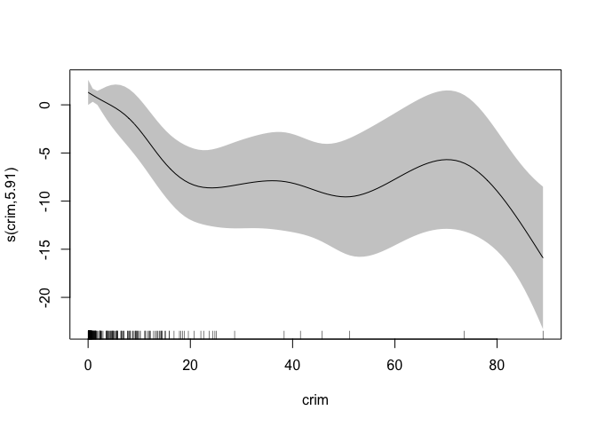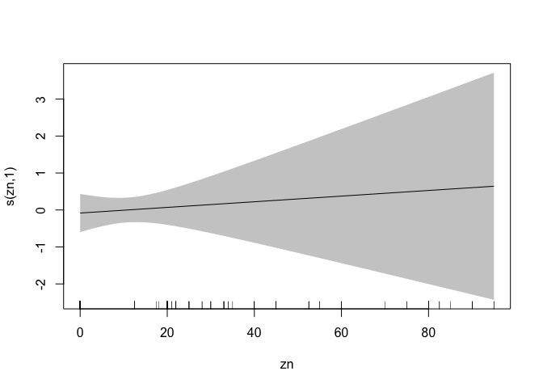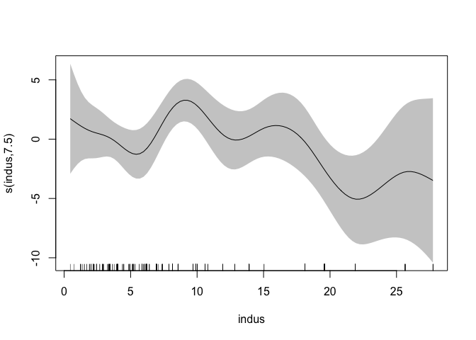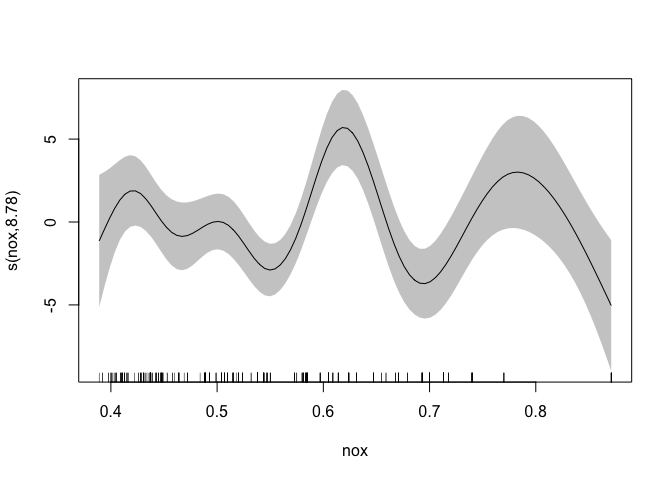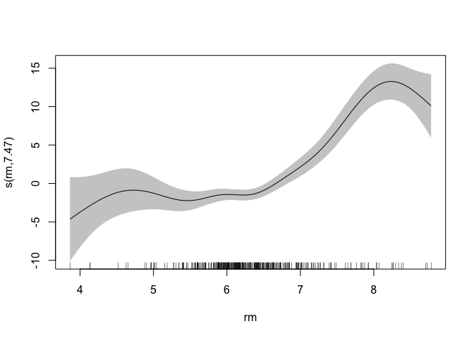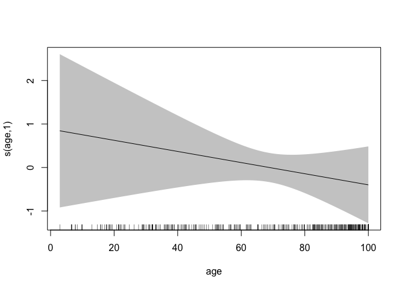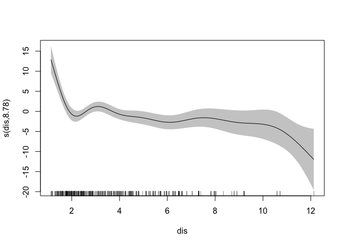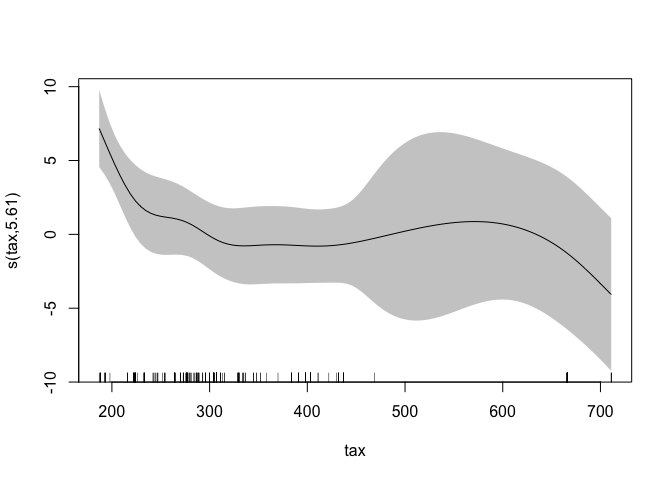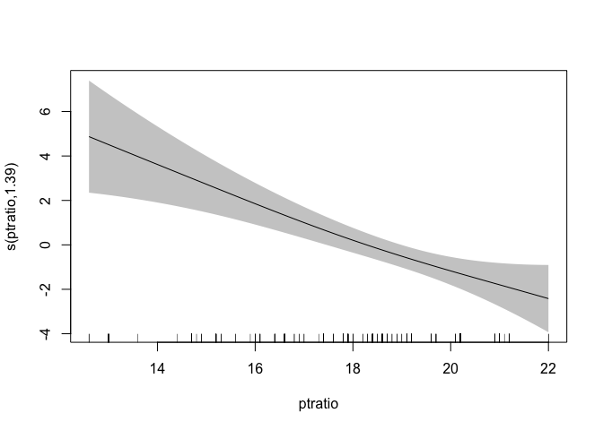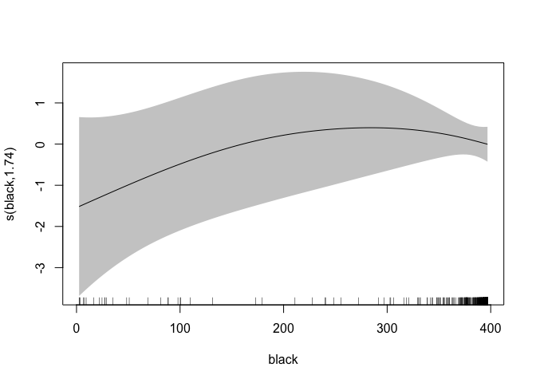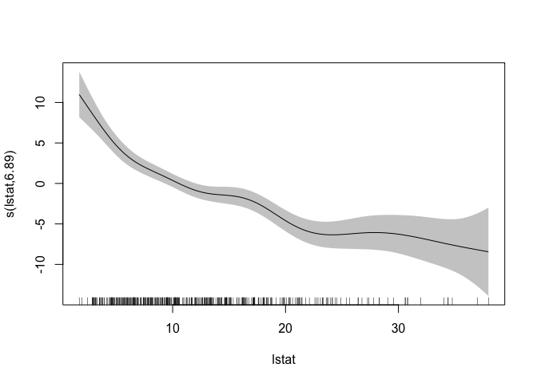

``` r
#In-sample performance
mean(residuals(gammodel)^2) #In-Sample
```

    ## [1] 8.781975

``` r
pi1 = predict(object = gammodel, newdata = Boston.test2)
#Out of Sample performance
mean((pi1-Boston.test2$medv)^2) #Out of Sample
```

    ## [1] 8.139819

Cross-Validation
We perform Cross-Validation using a 10 fold approach and MSE- 16.5 which is much lesser than the previous results which shows more samples leads to better results and reduction in error

``` r
b <- train(medv~crim+zn+indus+chas+nox+rm+age+dis
           +rad+tax+ptratio+black+lstat, 
           data = Boston.train2,
           method = "gam",
           trControl = trainControl(method = "cv", number = 10),
           tuneGrid = data.frame(method = "GCV.Cp", select = FALSE)
)
mse<-b$results[3]^2
mse 
```

    ##      RMSE
    ## 1 16.5049

``` r
summary(b$finalModel)
```

    ## 
    ## Family: gaussian 
    ## Link function: identity 
    ## 
    ## Formula:
    ## .outcome ~ chas + rad + s(zn) + s(ptratio) + s(tax) + s(indus) + 
    ##     s(nox) + s(black) + s(age) + s(dis) + s(rm) + s(lstat) + 
    ##     s(crim)
    ## 
    ## Parametric coefficients:
    ##             Estimate Std. Error t value Pr(>|t|)    
    ## (Intercept)  18.9236     1.2912  14.656  < 2e-16 ***
    ## chas          1.0520     0.7579   1.388  0.16611    
    ## rad           0.4069     0.1352   3.009  0.00283 ** 
    ## ---
    ## Signif. codes:  0 '***' 0.001 '**' 0.01 '*' 0.05 '.' 0.1 ' ' 1
    ## 
    ## Approximate significance of smooth terms:
    ##              edf Ref.df      F  p-value    
    ## s(zn)      1.000  1.000  0.120  0.72967    
    ## s(ptratio) 1.665  2.079 16.144 1.52e-07 ***
    ## s(tax)     3.664  4.401  7.937 3.07e-06 ***
    ## s(indus)   6.649  7.650  3.227  0.00188 ** 
    ## s(nox)     8.936  8.994 13.904  < 2e-16 ***
    ## s(black)   1.724  2.130  1.406  0.25082    
    ## s(age)     1.000  1.000  0.833  0.36202    
    ## s(dis)     8.803  8.984  8.970 2.50e-12 ***
    ## s(rm)      7.643  8.527 19.418  < 2e-16 ***
    ## s(lstat)   6.852  7.956 16.278  < 2e-16 ***
    ## s(crim)    5.911  7.032  8.106 3.77e-09 ***
    ## ---
    ## Signif. codes:  0 '***' 0.001 '**' 0.01 '*' 0.05 '.' 0.1 ' ' 1
    ## 
    ## R-sq.(adj) =  0.882   Deviance explained = 89.9%
    ## GCV = 12.551  Scale est. = 10.668    n = 379

We find a massive difference between the testing, training errors of the GAM and GLM model hinting at the non-linearity of relationship and a flexible model which provides a lesser biased and a better model capturing the relationships as shown in some of the most non-linear relationships.

### Neural Networks

Neural networks is a machine learning process to fit very flexible models inspired by the actual neural networks in biology. It is generally used to approximate underlying model when large number of inputs are present.
It works through back propagation algorithm. The hidden layers and nodes are used to train the model. The ideal number of layers are determined by intuition and the entire model has very low interpretability but high prediction accuracy. This causes a trade-off depending on the end objective if it is prediction or inference.
The first step in fitting a neural network is scaling the data which is very important for the algorithm to converge. We used the min-max scaling and compared the results to the non-scaled results and cross-validated results as well. We also chose 2/3 of the number of variables in the first layer – 8 and the next layer is 2/3 of the first layer – 5.

``` r
#Scaling Inputs- To get a range from 0-1
maxs <- apply(Boston, 2, max) 
mins <- apply(Boston, 2, min)
scaled <- as.data.frame(scale(Boston, center = mins, scale = maxs - mins))
set.seed(10857825)
subset2 = sample(nrow(Boston), nrow(Boston) * 0.75)
Boston.train2 = scaled[subset2, ]
Boston.test2 = scaled[-subset2, ]
n <- names(Boston.train2)
f <- as.formula(paste("medv ~", paste(n[!n %in% "medv"], collapse = " + ")))
nnetmodel <- neuralnet(f, data=Boston.train2,hidden=c(8,5), linear.output = TRUE)
plot(nnetmodel)
?nnet
#Out of Sample
pr.nn<- neuralnet::compute(nnetmodel, Boston.test2[,1:13])
#Scaling back to get a prediction
pr.nn_ <- pr.nn$net.result*(max(Boston$medv)-min(Boston$medv))+min(Boston$medv)
test.r <- (Boston.test2$medv)*(max(Boston$medv)-min(Boston$medv))+min(Boston$medv)
sum((test.r - pr.nn_)^2)/nrow(Boston.test2)
```

    ## [1] 9.251475354

``` r
plot(Boston.test2$medv,pr.nn_,col='red',main='Real vs predicted NN',pch=18,cex=0.7)

#Without Scaling
set.seed(10857825)
subset2 = sample(nrow(Boston), nrow(Boston) * 0.75)
Boston.train2 = Boston[subset2, ]
Boston.test2 = Boston[-subset2, ]
n <- names(Boston.train2)
f <- as.formula(paste("medv ~", paste(n[!n %in% "medv"], collapse = " + ")))
nnetmodel <- neuralnet(f, data=Boston.train2,hidden=c(8,5), linear.output = TRUE)
plot(nnetmodel)
#Out of Sample
pr.nn<- neuralnet::compute(nnetmodel, Boston.test2[,1:13])
#Scaling back to get a prediction
pr.nn <- pr.nn$net.result
mean((pr.nn-Boston.test2$medv)^2)
```

    ## [1] 67.82238786

``` r
plot(Boston.test2$medv,pr.nn_,col='red',main='Real vs predicted NN',pch=18,cex=0.7)

#Cross-Validation
set.seed(10857825)
cv.error <- NULL
k <- 10
pbar <- create_progress_bar('text')
pbar$init(k)
```

    ## 
      |                                                                       
      |                                                                 |   0%

``` r
for(i in 1:k){
  index <- sample(1:nrow(Boston),round(0.9*nrow(Boston)))
  train.cv <- scaled[index,]
  test.cv <- scaled[-index,]
  
  nn <- neuralnet(f,data=train.cv,hidden=c(5,2),linear.output=T)
  
  pr.nn <- neuralnet::compute(nn,test.cv[,1:13])
  pr.nn <- pr.nn$net.result*(max(Boston$medv)-min(Boston$medv))+min(Boston$medv)
  
  test.cv.r <- (test.cv$medv)*(max(Boston$medv)-min(Boston$medv))+min(Boston$medv)
  
  cv.error[i] <- sum((test.cv.r - pr.nn)^2)/nrow(test.cv)
  
  pbar$step()
}
```

    ## 
      |                                                                       
      |======                                                           |  10%
      |                                                                       
      |=============                                                    |  20%
      |                                                                       
      |====================                                             |  30%
      |                                                                       
      |==========================                                       |  40%
      |                                                                       
      |================================                                 |  50%
      |                                                                       
      |=======================================                          |  60%
      |                                                                       
      |==============================================                   |  70%
      |                                                                       
      |====================================================             |  80%
      |                                                                       
      |==========================================================       |  90%
      |                                                                       
      |=================================================================| 100%

``` r
mean(cv.error) 
```

    ## [1] 13.11607185

MSE- In-Sample- Scaled- 3.5

MSE- Out-of-Sample-Scaled- 9.25

MSE- Out-of-Sample- Non-Scaled- 67.82

Cross-Validated Error- 13.11

We see that not scaling the data leads to very bad results. We also find that we might have a case of overfitting with the training error being very much lesser than the testing error which can be mitigated by the cross-validation.

### Support Vector Machines

Support vector machine (SVM) is touted as one of the best off-the-shelf classifying algorithm (with regression applications too). It handles non-linearity, well-regularized, has very few parameters(support vectors) and is very fast.

SVM algorithm works on finding a hyperplane which will maximize the distance between the hyperplane and the support vectors. The formulation of the hyperplane can be both linear and non-linear.
We use SVM on our data and from Table 6 find that our testing error is still lesser than training error and the underlying fit might be non-linear as the results are very similar to the non-linear model of GAM.

``` r
svmmodel<-svm(medv~., Boston.train2)
mean(residuals(svmmodel)^2)
```

    ## [1] 10.12973669

``` r
predsvm<- predict(svmmodel, Boston.test2)
mean((predsvm-Boston.test2$medv)^2)
```

    ## [1] 8.445063107

MSE- In-Sample- 10.13

MSE- Out-of-Sample- 8.44

### Bagging

Bagging is a meta-algorithm which works to decrease the variance of the prediction by generating additional data for training from original dataset using different combinations of the data which produces multisets of the original data.
Bagging produces multiple trees ( we have plotted 5000 trees) through this bootstrapping and averages the error across all these different bootstrapped samples thus effectively decreasing the variance. Bagging uses all the predictors to provide the output.

``` r
set.seed(10857825)
subset2 = sample(nrow(Boston), nrow(Boston) * 0.75)
Boston.train2 = Boston[subset2, ]
Boston.test2 = Boston[-subset2, ]
set.seed(10857825)
?randomForest
bag.boston=randomForest(medv~.,data=Boston.train2,mtry=13,importance=TRUE)
bag.boston
```

    ## 
    ## Call:
    ##  randomForest(formula = medv ~ ., data = Boston.train2, mtry = 13,      importance = TRUE) 
    ##                Type of random forest: regression
    ##                      Number of trees: 500
    ## No. of variables tried at each split: 13
    ## 
    ##           Mean of squared residuals: 12.55961538
    ##                     % Var explained: 86.06

``` r
pred.bag = predict(bag.boston,newdata=Boston.test2)
mean((pred.bag-Boston.test2$medv)^2)
```

    ## [1] 5.354245486

MSE- In-Sample- 12.55

MSE- Out-of-Sample- 5.35

### Random Forests

Random Forests is a simple variation of the bagging algorithm, where the number of predictors used at each split is not the same. By varying the number of predictors, this algorithm further reduces the variance and the bias in the model.

``` r
rf.boston=randomForest(medv~.,data=Boston.train2,mtry=6,importance=TRUE)
rf.boston
```

    ## 
    ## Call:
    ##  randomForest(formula = medv ~ ., data = Boston.train2, mtry = 6,      importance = TRUE) 
    ##                Type of random forest: regression
    ##                      Number of trees: 500
    ## No. of variables tried at each split: 6
    ## 
    ##           Mean of squared residuals: 11.77207791
    ##                     % Var explained: 86.94

``` r
pred.rf = predict(rf.boston,newdata=Boston.test2)
mean((pred.rf-Boston.test2$medv)^2)
```

    ## [1] 4.988407067

MSE- In-Sample- 11.77

MSE- Out-of-Sample- 4.99

### Boosting

Boosting is a two step approach where after bootstrapping, the performance is further boosted using a cost function in the algorithm and the subset creation is not random like in bagging but contains elements which might be misclassified by previous models.
We implement gradient boosting algorithm with 5000 trees, which also gives the relative influence of the different variables, which shows rm and lstat are the most important and influential variables for the prediction model.

``` r
set.seed(10857825)
boost.boston=gbm(medv~.,data=Boston.train2,distribution="gaussian",n.trees=5000,interaction.depth=4)
summary(boost.boston)
```

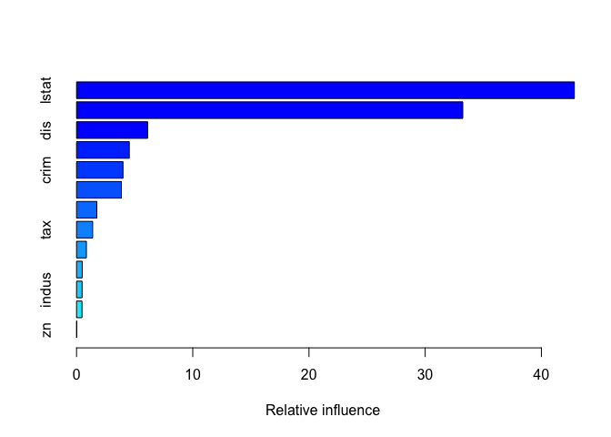

    ##             var        rel.inf
    ## lstat     lstat 42.83385489344
    ## rm           rm 33.23495029298
    ## dis         dis  6.11493131428
    ## nox         nox  4.53627431139
    ## crim       crim  3.99556662647
    ## ptratio ptratio  3.85859488402
    ## age         age  1.74537638669
    ## tax         tax  1.38635361859
    ## black     black  0.84723922878
    ## rad         rad  0.48841349890
    ## indus     indus  0.47688640344
    ## chas       chas  0.46774245539
    ## zn           zn  0.01381608564

``` r
pred.boost=predict(boost.boston,newdata=Boston.test2,n.trees=5000)
mean((pred.boost-Boston.test2$medv)^2)
```

    ## [1] 5.711793599

``` r
pred.boost2=predict(boost.boston,n.trees=5000)
mean((pred.boost2-Boston.train2$medv)^2)
```

    ## [1] 7.824152192

MSE- In-Sample- 7.83

MSE- Out-of-Sample- 5.71
