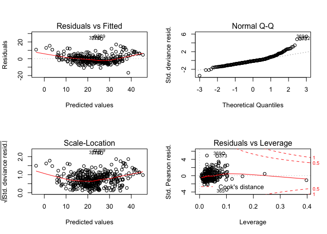
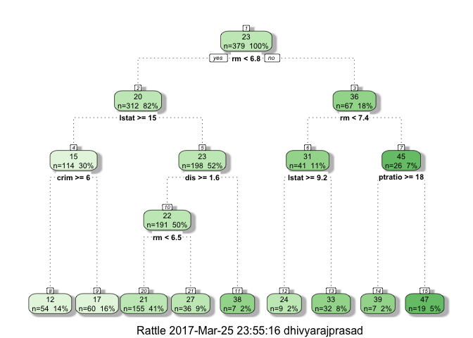
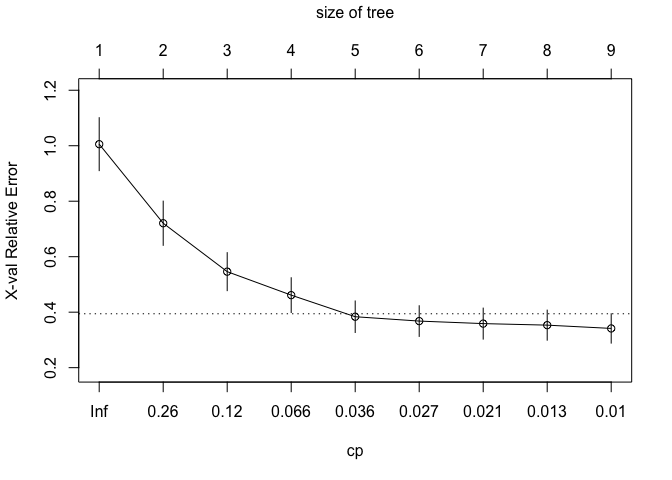

Building a Prediction Model using ML Techniques- Techniques Used: GLM, Tree, GAM, Neural Networks, SVM, Random Forests, Bagging and Boosting
================

References
----------

1.  [Introduction to statistical learning](http://www-bcf.usc.edu/~gareth/ISL/)
2.  [Elements of statistical learning](https://statweb.stanford.edu/~tibs/ElemStatLearn/)
3.  [R Bloggers](https://www.r-bloggers.com/)

Purpose of the Case Study
-------------------------

Fit predictive models and compare their performance using some error metrics.

We want to compare between different advanced and more flexibile machine learning techniques and compare the interpretation once the complexity increases and bias decreases.

Packages Used and Data subsetting
---------------------------------

The below packages are used for loading data, visualizations, model building and for creating creative plots of the results from each model.

``` r
library(MASS) #Boston Housing Data Set
library(dplyr) #Data Wrangling
library(tidyverse) #Data Wrangling
library(knitr) #Knitting RMDs and functionalities
library(reshape2) #Data Wrangling
library(ggplot2) #Data Visualization
library(GGally) #Data Visualization
library(leaps) #Best Subset selection
library(boot) #Resampling methods
library(rpart) #Tree modeling
library(rattle) #Better Vizzes
library(mgcv) #GAM modeling
library(neuralnet) #Neural Networks Model
library(plyr) #Data Wrangling
library(caret) #Cross Validation for Neural Networks
library(e1071) #SVM model
library(glmnet) #Ridge, Lasso and Elastic Regression
```

We set up the data using a random seed to sample the data into 75% training and 25% training data. We dont have sufficient data points to have a validation data as well.

``` r
#Set Seed
set.seed(10857825)
#Training and Testing Data
subset2 = sample(nrow(Boston), nrow(Boston) * 0.75)
Boston.train2 = Boston[subset2, ]
Boston.test2 = Boston[-subset2, ]
```

Model Performance Indicators
----------------------------

We will use the following paramters to explain the model performance and the intrinsic differences in the fitting of various models. We can extract all of these results from the fit statement which has a list of stored values for each model. **AIC**- Akaike's Information Criterion offers a relative estimate of the infomration lost wen a given model is used to fit the data. It deals with the trade-off between goodness of fit of the model and the complexity of the model. The lower the AIC, better the model. **BIC**- Bayesian Information Criterion/ Schwartz Criterion offers a similar trade-off between goodness of fit and complexity of model but penalizes the complexity more than AIC as the number of paramters added to the model increases, typically having BIC values &gt; AIC values. Lower the BIC, Better the model. **MSE**- Mean Square Error is the average distance between the observed values and the predicted values. Lower the MSE, more accurate the model.

GLM and Cross-Validation for GLM
--------------------------------

We find the following parameters from the GLM model: AIC: 2325.8 BIC: 2380.9 MSE: 25.02- In-Sample MSE: 13.22- Out of Sample

If out of sample error is very much lesser than in sample, our model is either very good or we are not predicting the underlying fit properly. So, we need to perform cross-validation to conifrm our error values.

``` r
set.seed(10857825)
glmmodel=glm(medv~., data=Boston.train2)
summary(glmmodel)
```

    ## 
    ## Call:
    ## glm(formula = medv ~ ., data = Boston.train2)
    ## 
    ## Deviance Residuals: 
    ##      Min        1Q    Median        3Q       Max  
    ## -16.7230   -2.9382   -0.6111    1.6522   26.5421  
    ## 
    ## Coefficients:
    ##               Estimate Std. Error t value Pr(>|t|)    
    ## (Intercept)  35.535363   6.079163   5.845 1.12e-08 ***
    ## crim         -0.110591   0.040294  -2.745  0.00636 ** 
    ## zn            0.046300   0.017115   2.705  0.00715 ** 
    ## indus         0.015024   0.074750   0.201  0.84082    
    ## chas          2.796969   1.096284   2.551  0.01114 *  
    ## nox         -19.265129   4.895032  -3.936 9.94e-05 ***
    ## rm            4.151200   0.505171   8.217 3.66e-15 ***
    ## age          -0.006626   0.016175  -0.410  0.68230    
    ## dis          -1.500208   0.239003  -6.277 9.80e-10 ***
    ## rad           0.338313   0.082925   4.080 5.54e-05 ***
    ## tax          -0.012047   0.004590  -2.625  0.00904 ** 
    ## ptratio      -0.944057   0.160557  -5.880 9.28e-09 ***
    ## black         0.007953   0.003485   2.282  0.02306 *  
    ## lstat        -0.501237   0.063142  -7.938 2.55e-14 ***
    ## ---
    ## Signif. codes:  0 '***' 0.001 '**' 0.01 '*' 0.05 '.' 0.1 ' ' 1
    ## 
    ## (Dispersion parameter for gaussian family taken to be 25.98128)
    ## 
    ##     Null deviance: 34152.5  on 378  degrees of freedom
    ## Residual deviance:  9483.2  on 365  degrees of freedom
    ## AIC: 2325.8
    ## 
    ## Number of Fisher Scoring iterations: 2

``` r
extractAIC(glmmodel)
```

    ## [1]   14.000 2325.836

``` r
extractAIC(glmmodel, k=log(nrow(Boston.train2))) 
```

    ## [1]   14.000 2380.961

``` r
#Prediction with training data
pi1_IS = predict(object = glmmodel, newdata = Boston.train2)
mean((pi1_IS-Boston.train2$medv)^2)
```

    ## [1] 25.02155

``` r
#Prediction with testing data

pi1_OS = predict(object = glmmodel, newdata = Boston.test2)
mean((pi1_OS-Boston.test2$medv)^2)
```

    ## [1] 13.21715

``` r
#Residual Plots
par(mfrow=c(2,2))
plot(glmmodel)
```



We perform Cross-Validation now to find out the MSE value which is MSE- 23.40

which shows that there might be a very high possiblity of an 'unknown fit' influencing the results

``` r
set.seed(10857825)
fullmodel = glm(medv ~ ., data=Boston)
cvmodel2<-cv.glm(data = Boston, 
                       glmfit = fullmodel, K = 3)
cvmodel2$delta[2]
```

    ## [1] 23.40182

Regression Trees and Cross-Validation for Regression Trees
----------------------------------------------------------

We use Regression trees to try and predict the median housing values and compare with our previous model, which has the problem of not knowing the exact underlying fit. MSE- In-Sample- 17.04 MSE- Out-of-Sample- 11.78 which is again good results.

We try to prune the tree to the lowest CP and find the following results. MSE- In-Sample- 17.04 MSE- Out-of-Sample- 11.78 which gives similar values as randomly chosen cp, which shows the chances of overfitting is very less in our original model.

``` r
#Regression Trees
boston.rpart <- rpart(formula = medv ~ ., data = Boston.train2)
fancyRpartPlot(boston.rpart)
```



``` r
boston.train.pred.tree = predict(boston.rpart, Boston.train2)
mean((boston.train.pred.tree - Boston.train2$medv)^2)
```

    ## [1] 17.03536

``` r
boston.test.pred.tree = predict(boston.rpart, Boston.test2)
mean((boston.test.pred.tree - Boston.test2$medv)^2)
```

    ## [1] 11.7792

We perform pruning of the tree to compare with the previous results to test for overfitting.

``` r
#Pruning rpart cp
plotcp(boston.rpart)
```



``` r
printcp(boston.rpart)
```

    ## 
    ## Regression tree:
    ## rpart(formula = medv ~ ., data = Boston.train2)
    ## 
    ## Variables actually used in tree construction:
    ## [1] crim    dis     lstat   ptratio rm     
    ## 
    ## Root node error: 34153/379 = 90.112
    ## 
    ## n= 379 
    ## 
    ##         CP nsplit rel error  xerror     xstd
    ## 1 0.440391      0   1.00000 1.00564 0.095394
    ## 2 0.151226      1   0.55961 0.72064 0.079644
    ## 3 0.091478      2   0.40838 0.54608 0.068456
    ## 4 0.047717      3   0.31690 0.46143 0.062646
    ## 5 0.026640      4   0.26919 0.38361 0.056757
    ## 6 0.026617      5   0.24255 0.36791 0.055244
    ## 7 0.016346      6   0.21593 0.35879 0.055840
    ## 8 0.010538      7   0.19958 0.35325 0.054147
    ## 9 0.010000      8   0.18905 0.34140 0.052876

``` r
boston.prune = prune(boston.rpart, cp = boston.rpart$cptable[which.min(boston.rpart$cptable[,"xerror"]),"CP"])
fancyRpartPlot(boston.prune)
```


``` r
boston.train.pred.tree.prune = predict(boston.prune, Boston.train2)
mean((boston.train.pred.tree.prune - Boston.train2$medv)^2)
```

    ## [1] 17.03536

``` r
boston.test.pred.tree.prune = predict(boston.prune, Boston.test2)
mean((boston.test.pred.tree.prune - Boston.test2$medv)^2)
```

    ## [1] 11.7792

GAM- Generalized Additive Model
-------------------------------

We use Generalized Additive model as a more flexible approach (than rigid GLM) to try and predict the median housing values and compare with our previous models. AIC- 2423.30 BIC-2462.68 MSE- In-Sample- 33.22 MSE- Out-of-Sample- 25.40 which again indicates the need for better underfitting models.

``` r
gam_formula <- as.formula(paste("medv~crim+zn+indus+chas+nox+rm+age+dis+rad+tax+ptratio+black+lstat"))
gammodel <- gam(formula = gam_formula,family=gaussian ,data = Boston.train2)
gammodel_summary<-summary(gammodel)
AIC(gammodel) 
```

    ## [1] 2325.836

``` r
BIC(gammodel) 
```

    ## [1] 2384.899

``` r
#In-sample performance
mean(residuals(gammodel)^2) #In-Sample
```

    ## [1] 25.02155

``` r
pi1 = predict(object = gammodel, newdata = Boston.test2)
#Out of Sample performance
mean((pi1-Boston.test2$medv)^2) #Out of Sample
```

    ## [1] 13.21715

Cross-Validation
We perform Cross-Validation using a 10 fold approach and MSE- 11.74 which is much lesser than the previous results which shows more samples leads to better results and reduction in error

``` r
b <- train(medv~crim+zn+indus+chas+nox+rm+age+dis
           +rad+tax+ptratio+black+lstat, 
           data = Boston.train2,
           method = "gam",
           trControl = trainControl(method = "cv", number = 10),
           tuneGrid = data.frame(method = "GCV.Cp", select = FALSE)
)
mse<-b$results[3]^2
mse #MSE 15.43
```

    ##      RMSE
    ## 1 16.5049

``` r
summary(b$finalModel)
```

    ## 
    ## Family: gaussian 
    ## Link function: identity 
    ## 
    ## Formula:
    ## .outcome ~ chas + rad + s(zn) + s(ptratio) + s(tax) + s(indus) + 
    ##     s(nox) + s(black) + s(age) + s(dis) + s(rm) + s(lstat) + 
    ##     s(crim)
    ## 
    ## Parametric coefficients:
    ##             Estimate Std. Error t value Pr(>|t|)    
    ## (Intercept)  18.9236     1.2912  14.656  < 2e-16 ***
    ## chas          1.0520     0.7579   1.388  0.16611    
    ## rad           0.4069     0.1352   3.009  0.00283 ** 
    ## ---
    ## Signif. codes:  0 '***' 0.001 '**' 0.01 '*' 0.05 '.' 0.1 ' ' 1
    ## 
    ## Approximate significance of smooth terms:
    ##              edf Ref.df      F  p-value    
    ## s(zn)      1.000  1.000  0.120  0.72967    
    ## s(ptratio) 1.665  2.079 16.144 1.52e-07 ***
    ## s(tax)     3.664  4.401  7.937 3.07e-06 ***
    ## s(indus)   6.649  7.650  3.227  0.00188 ** 
    ## s(nox)     8.936  8.994 13.904  < 2e-16 ***
    ## s(black)   1.724  2.130  1.406  0.25082    
    ## s(age)     1.000  1.000  0.833  0.36202    
    ## s(dis)     8.803  8.984  8.970 2.50e-12 ***
    ## s(rm)      7.643  8.527 19.418  < 2e-16 ***
    ## s(lstat)   6.852  7.956 16.278  < 2e-16 ***
    ## s(crim)    5.911  7.032  8.106 3.77e-09 ***
    ## ---
    ## Signif. codes:  0 '***' 0.001 '**' 0.01 '*' 0.05 '.' 0.1 ' ' 1
    ## 
    ## R-sq.(adj) =  0.882   Deviance explained = 89.9%
    ## GCV = 12.551  Scale est. = 10.668    n = 379

Neural Networks
---------------

We go for more flexible approaches in Machine Learning now with Neural Networks approach.

``` r
#Scaling Inputs- To get a range from 0-1
maxs <- apply(Boston, 2, max) 
mins <- apply(Boston, 2, min)
scaled <- as.data.frame(scale(Boston, center = mins, scale = maxs - mins))
subset2 = sample(nrow(Boston), nrow(Boston) * 0.75)
Boston.train2 = scaled[subset2, ]
Boston.test2 = scaled[-subset2, ]
n <- names(Boston.train2)
f <- as.formula(paste("medv ~", paste(n[!n %in% "medv"], collapse = " + ")))
nnetmodel <- neuralnet(f, data=Boston.train2,hidden=c(5,3), linear.output = TRUE)
plot(nnetmodel)
#Out of Sample
pr.nn<- compute(nnetmodel, Boston.test2[,1:13])
#Scaling back to get a prediction
pr.nn_ <- pr.nn$net.result*(max(Boston$medv)-min(Boston$medv))+min(Boston$medv)
test.r <- (Boston.test2$medv)*(max(Boston$medv)-min(Boston$medv))+min(Boston$medv)
sum((test.r - pr.nn_)^2)/nrow(Boston.test2)#MSE 13.613
```

    ## [1] 22.65849055

``` r
plot(Boston.test2$medv,pr.nn_,col='red',main='Real vs predicted NN',pch=18,cex=0.7)
legend('bottomright',legend='NN',pch=18,col='red', bty='n')
#Cross-Validation
cv.error <- NULL
k <- 10
pbar <- create_progress_bar('text')
pbar$init(k)
```

    ## 
      |                                                                       
      |                                                                 |   0%

``` r
for(i in 1:k){
  index <- sample(1:nrow(Boston),round(0.9*nrow(Boston)))
  train.cv <- scaled[index,]
  test.cv <- scaled[-index,]
  
  nn <- neuralnet(f,data=train.cv,hidden=c(5,2),linear.output=T)
  
  pr.nn <- compute(nn,test.cv[,1:13])
  pr.nn <- pr.nn$net.result*(max(Boston$medv)-min(Boston$medv))+min(Boston$medv)
  
  test.cv.r <- (test.cv$medv)*(max(Boston$medv)-min(Boston$medv))+min(Boston$medv)
  
  cv.error[i] <- sum((test.cv.r - pr.nn)^2)/nrow(test.cv)
  
  pbar$step()
}
```

    ## 
      |                                                                       
      |======                                                           |  10%
      |                                                                       
      |=============                                                    |  20%
      |                                                                       
      |====================                                             |  30%
      |                                                                       
      |==========================                                       |  40%
      |                                                                       
      |================================                                 |  50%
      |                                                                       
      |=======================================                          |  60%
      |                                                                       
      |==============================================                   |  70%
      |                                                                       
      |====================================================             |  80%
      |                                                                       
      |==========================================================       |  90%
      |                                                                       
      |=================================================================| 100%

``` r
mean(cv.error) #MSE- 11.10
```

    ## [1] 10.88866224

Support Vector Machines
-----------------------

``` r
svmmodel<-svm(medv~., Boston.train2)
mean(residuals(svmmodel)^2)#Insample 11.06
```

    ## [1] 0.00505480636

``` r
predsvm<- predict(svmmodel, Boston.test2)
mean((predsvm-Boston.test2$medv)^2)#Out of Sample 7.47
```

    ## [1] 0.004471030146
